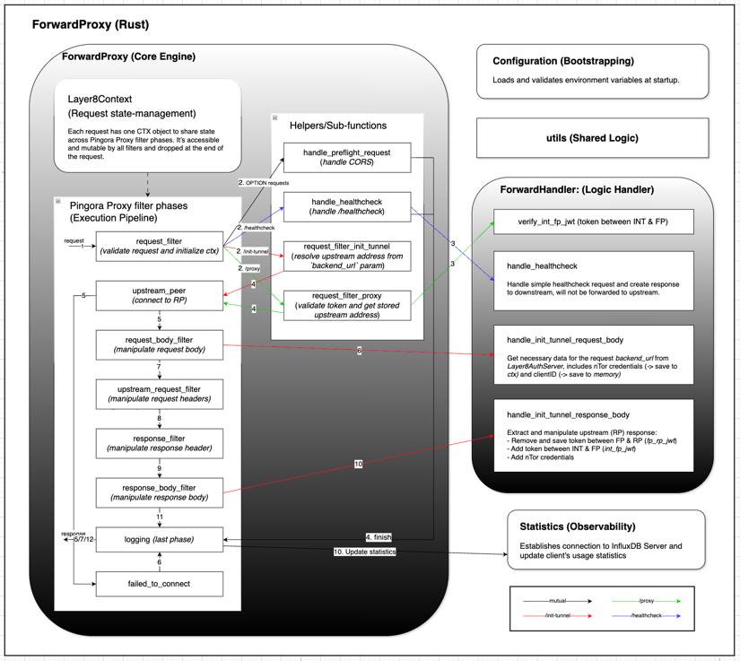

# ForwardProxy — Technical Architecture & Design Document (Draft)

**Implementation Language:** Rust | **Proxy Engine:** Pingora

Assuming familiarity with the Layer8 architecture and the role of the ForwardProxy, this document provides a technical
overview of the ForwardProxy's design, architecture, and implementation details. It serves as a reference for developers
working on the ForwardProxy component, outlining its responsibilities, project structure, configuration options, and key
implementation details.

<br>

### *Table of contents:*

- [1. Overview](#1-overview)
- [2. Project Structure](#2-project-structure)
- [3. Deployment Diagram](#3-deployment-diagram)
- [4. Configuration](#4-configuration)
- [5. Request Lifecycle](#5-request-lifecycle-pingora-filters)
    - [5.1. Layer8Context (CTX - Request State Management)](#51-layer8context-ctx---request-state-management)
    - [5.2. `request_filter` Phase](#52-request_filter-phase)
    - [5.3. `upstream_peer` Phase](#53-upstream_peer-phase)
    - [5.4. `request_body_filter` Phase](#54-request_body_filter-phase)
    - [5.5. `upstream_request_filter` Phase](#55-upstream_request_filter-phase)
    - [5.6. `response_filter` Phase](#56-response_filter-phase)
    - [5.7. `response_body_filter` Phase](#57-response_body_filter-phase)
    - [5.8. `logging` Phase](#58-logging-phase)
    - [5.9. `failed_to_connect` Phase](#59-failed_to_connect-phase)
- [6. API Handlers](#6-api-handlers)
    - [6.1. Session Management](#61-session-management)
    - [6.2. Verify `int_fp_jwt` Token](#62-verify-int_fp_jwt-token)
    - [6.3. Handle `/init-tunnel` Request](#63-handle-init-tunnel-request)
    - [6.4. Handle `/init-tunnel` Response](#64-handle-init-tunnel-response)
    - [6.5. Handle `/healthcheck`](#65-handle-healthcheck)
- [7. Usage Statistics](#7-usage-statistics-badly-drafted-needs-work)
- [8. Dynamic mTLS Certificate Loading](#8-dynamic-mtls-certificate-loading)

<div style="page-break-after: always;"></div>

## 1. Overview

The ForwardProxy (FP) is a Rust-based network proxy built on the Pingora proxy framework. It sits between client-side
Interceptors and backend Reverse Proxies, acting as the central trust broker and traffic relay in a privacy-preserving
network architecture. Its primary responsibility is to manage secure tunnel establishment (`/init-tunnel`) and
facilitate the secure routing of encrypted traffic (`/proxy`) while maintaining session state and validating
authentication tokens.



*Figure 1: ForwardProxy high-level architecture*

Its responsibilities include:

- Managing request lifecycle via Pingora filter phases
- Managing tunnel initialization with backend Reverse Proxies (`/init-tunnel` flow)
- Injecting and stripping security tokens across the proxy boundary
- Forwarding encrypted `/proxy` requests to the appropriate Reverse Proxy
- Maintaining ephemeral session state
- Collecting usage statistics to InfluxDB

<div style="page-break-after: always;"></div>

## 2. Project Structure

The ForwardProxy project is organized into the following modules:

```
├── `forward-proxy` — Intercepts and relays incoming requests; central trust broker.
│   ├── `src`
│   │   ├── `handler` — Request handling pipeline: routing, validation, token injection/stripping. See `forward-proxy/src/handler/README.md`.
│   │   │   ├── `types`
│   │   │   │   ├── `request.rs` — Incoming request schemas and deserialization.
│   │   │   │   ├── `response.rs` — Outgoing response structures and serialization.
│   │   │   │   └── `mod.rs` — Exports request/response types.
│   │   │   ├── `consts.rs` — Local constants (timeouts, default headers).
│   │   │   └── `mod.rs` — Handler public API and routing glue.
│   │   ├── `statistics` — Emits usage metrics to InfluxDB; includes batch and tagging logic. See `forward-proxy/src/statistics/README.md`.
│   │   ├── `config.rs` — Runtime configuration loader from env files and `Cargo.toml` defaults.
│   │   ├── `proxy.rs` — Core forwarding engine implementing the Pingora request lifecycle and tunnel flows.
│   │   └── `main.rs` — Application entrypoint: initialize config, logging, metrics, and register Pingora filters.
│   ├── `Dockerfile`
│   ├── `.env.dev`
│   ├── `.env.docker`
│   ├── `build.rs`
│   └── `Cargo.toml`
│
├── `utils` — Shared helpers and cross-crate utilities.
│
├── `pingora-router`
│   ├── `src`
│   │   ├── `ctx.rs` — Public `Layer8Context` struct: per-request state, auth claims, and tracing fields.
│   │   ├── `mod.rs` — Router public API and layer composition; documents exported traits and types.
│   │   └── ...
```

<div style="page-break-after: always;"></div>

## 3. Deployment Diagram

[todo]
<br>

## 4. Configuration

All configuration is loaded from environment variables at startup (defined in `.env.dev` for development
and `.env.docker` for Docker deployment) and deserialized into `FPConfig`. The struct is composed of five
flattened sub-configs.
<br>

### 4.1. Server (`FPConfig`)

| Variable         | Type     | Example     | Description                   |
|------------------|----------|-------------|-------------------------------|
| `LISTEN_ADDRESS` | `String` | `localhost` | Address the proxy listens on. |
| `LISTEN_PORT`    | `u16`    | `6191`      | Port the proxy listens on.    |

---
<br>

### 4.2. Logging (`LogConfig`)

| Variable       | Type     | Example             | Description                                                            |
|----------------|----------|---------------------|------------------------------------------------------------------------|
| `LOG_LEVEL`    | `String` | `trace`             | Verbosity level (`trace`, `debug`, `info`, `warn`, `error`).           |
| `LOG_FORMAT`   | `String` | `plain`             | Output format. Defaults to `json` unless set to `plain`.               |
| `LOG_PATH`     | `String` | `console`           | Set to `console` for stdout, or provide a folder path for file output. |
| `LOG_FILENAME` | `String` | `forward-proxy.log` | Log filename. Required when `LOG_PATH` is not `console`.               |

---
<br>

### 4.3. Handler (`HandlerConfig`)

| Variable                     | Type      | Example                                  | Description                                                                                                    |
|------------------------------|-----------|------------------------------------------|----------------------------------------------------------------------------------------------------------------|
| `JWT_VIRTUAL_CONNECTION_KEY` | `Vec<u8>` | `secret`                                 | Signing key for `int_fp_jwt` tokens. Deserialized from string to bytes.                                        |
| `JWT_EXP_IN_HOURS`           | `i64`     | `24`                                     | Expiry duration for issued JWT tokens, in hours.                                                               |
| `AUTH_ACCESS_TOKEN`          | `String`  | `Basic bGF5ZXI4...`                      | Bearer/Basic token used to authenticate requests to the Auth Server.                                           |
| `AUTH_GET_CERTIFICATE_URL`   | `String`  | `http://l8.net/api/v1/cert?backend_url=` | Auth Server endpoint for fetching nTor certificates. The `backend_url` query parameter is appended at runtime. |

---
<br>

### 4.4. Proxy & mTLS (`ProxyConfig` / `TLSConfig`)

| Variable                 | Type          | Example                           | Description                                         |
|--------------------------|---------------|-----------------------------------|-----------------------------------------------------|
| `CORS_ALLOW_CREDENTIALS` | `bool`        | `true`                            | Whether to allow credentials in CORS requests.      |
| `CORS_ALLOW_ORIGINS`     | `Vec<String>` | `http://localhost:5173,...`       | Comma-separated list of allowed CORS origins.       |
| `ENABLE_TLS`             | `bool`        | `true`                            | Enables mutual TLS (mTLS) for upstream connections. |
| `CA_PATH`                | `String`      | `../certs/mtls/ca.pem`            | Path to the CA certificate for mTLS verification.   |
| `CERT_PATH`              | `String`      | `../certs/mtls/forward-proxy.pem` | Path to the ForwardProxy's client certificate.      |
| `KEY_PATH`               | `String`      | `../certs/mtls/forward-proxy.key` | Path to the ForwardProxy's private key.             |

---
<br>

### 4.5. InfluxDB (`InfluxDBConfig`)

| Variable              | Type     | Example                     | Description                                |
|-----------------------|----------|-----------------------------|--------------------------------------------|
| `INFLUXDB_URL`        | `String` | `http://localhost:8086`     | InfluxDB server URL.                       |
| `INFLUXDB_ORG`        | `String` | `layer8org`                 | InfluxDB organization name.                |
| `INFLUXDB_BUCKET`     | `String` | `layer8bucket`              | InfluxDB bucket for writing usage metrics. |
| `INFLUXDB_AUTH_TOKEN` | `String` | `DEFAULT_TOKEN_FOR_TESTING` | Authentication token for the InfluxDB API. |

---
<div style="page-break-after: always;"></div>

## 5. Request Lifecycle (Pingora Filters)

Pingora executes requests through a deterministic pipeline of filter phases. The table below documents each phase, its
trigger condition, and its responsibility within the ForwardProxy. (See
the [Pingora phase documentation](https://github.com/cloudflare/pingora/blob/main/docs/user_guide/phase.md) for
execution order and request processing details.)

<br>

### 5.1 Layer8Context (CTX - Request State Management)

Each inbound request is assigned a single `Layer8Context` (CTX) object. This object acts as a shared, mutable state
container that flows through all Pingora filter phases for the duration of a request.

- One CTX object is created per request.
- Accessible and mutable by all registered Pingora filters.
- Automatically dropped at the end of the request lifecycle — no manual cleanup required.

<br>

### 5.2. `request_filter` Phase

The `request_filter` is the initial phase for all incoming requests. It initializes the CTX, validates the request, and
routes it to the appropriate handler based on the API path:

| API Path            | Responsibility                                                                                                                                                                                            | Error Cases                                                                                                  | Next Phase \(if success, otherwise [logging](#58-logging-phase)\) |
|---------------------|-----------------------------------------------------------------------------------------------------------------------------------------------------------------------------------------------------------|--------------------------------------------------------------------------------------------------------------|-------------------------------------------------------------------|
| OPTION requests     | If the request is an OPTIONS preflight CORS request, it is immediately responded to with appropriate CORS headers and a 200 OK status, bypassing further processing.                                      |                                                                                                              | [logging](#58-logging-phase)                                      |
| GET `/healthcheck`  | Validates the request and returns a simple 200 OK response if the service is healthy, see [handle `/healthcheck`](#65-handle-healthcheck).                                                                |                                                                                                              | [logging](#58-logging-phase)                                      |
| POST `/init-tunnel` | - Validates `backend_url` query param<br>- Resolves `backend_url` to socket addresses for upstream connection in next phase (`backend_url` will be saved as `rp_base_url` if this request succeeds)       | - `backend_url` param is missing or invalid URL format<br>- Internal Error                                   | [upstream_peer](#53-upstream_peer-phase)                          |
| POST `/proxy`       | - Validates `int_fp_jwt` header token<br>- Retrieves init-tunnel session using `int_fp_jwt` from storage<br>- Resolves `rp_base_url` in session to socket addresses for upstream connection in next phase | - Token signature is invalid or expired (additional verification is under consideration)<br>- Internal Error | [upstream_peer](#53-upstream_peer-phase)                          |

----
<br>

### 5.3. `upstream_peer` Phase

The `upstream_peer` phase establishes connection to the target Reverse Proxy (RP) using socket addresses resolved
in `request_filter`.

- If `ENABLE_TLS` is `true`, it uses mTLS with the configured CA, client certificate, and private key.
- If `ENABLE_TLS` is `false`, it uses plain TCP.
- Only `POST /init-tunnel` and `POST /proxy` reach this phase; other requests are skipped.
- On connection failure, `failed_to_connect` is invoked: the failed socket address is removed from the candidate list,
  and the proxy retries with the next available address
  (see [failed\_to\_connect phase](#59-failed_to_connect-phase)).
- On successful connection, processing continues in the `request_body_filter` phase, where the request is prepared for
  upstream forwarding.

<br>

### 5.4. `request_body_filter` Phase

The `request_body_filter` phase is responsible for reading and potentially manipulating the request body before it is
forwarded to the upstream Reverse Proxy.

| API Path            | Responsibility                                                                                                                                                                                     | Error Cases                                                                                                                                                     | Next Phase                                                     |
|---------------------|----------------------------------------------------------------------------------------------------------------------------------------------------------------------------------------------------|-----------------------------------------------------------------------------------------------------------------------------------------------------------------|----------------------------------------------------------------|
| POST `/init-tunnel` | Reads the full body payload, validates it, and fetches the nTor server certificate for `backend_url` from the Auth Server \(see [handle `/init-tunnel` request](#63-handle-init-tunnel-request)\). | - Invalid JSON body format or missing required fields<br>- Cannot connect to the Auth Server<br>- Error while handling Auth Server response<br>- Internal Error | [upstream\_request\_filter](#55-upstream_request_filter-phase) |
| POST `/proxy`       | Reads the full body payload and forwards it unchanged.                                                                                                                                             | None                                                                                                                                                            | [upstream\_request\_filter](#55-upstream_request_filter-phase) |

----
<br>

### 5.5. `upstream_request_filter` Phase

The `upstream_request_filter` phase manipulates the outgoing request headers before the request is sent to the upstream
Reverse Proxy. This includes:

| API Path            | Responsibility  (API-specific only; shared upstream header policy applies to all handlers as described below)                                                                        | Error Cases           | Next Phase                                   |
|---------------------|--------------------------------------------------------------------------------------------------------------------------------------------------------------------------------------|-----------------------|----------------------------------------------|
| POST `/init-tunnel` | None (the request body contains the NTor credentials, so no header manipulation is needed in this phase)                                                                             | None                  | [response_filter](#56-response_filter-phase) |
| POST `/proxy`       | - Retrieves init-tunnel session using `int_fp_jwt`<br>- Get `fp_rp_jwt` token from session and injects it into upstream headers<br>- Removes `int_fp_jwt` before forwarding upstream | Failed to get session | [response_filter](#56-response_filter-phase) |

----
<br>

**Unified upstream header policy** (applies to all API handlers)
Before forwarding requests to upstream:

1. If `x-empty-body` is absent, remove `content-length` and force `transfer-encoding: chunked` to support
   streaming/unknown body sizes.
2. `x-correlation-id` can be attached for end-to-end tracing across services.
   This behavior is intentionally shared across all API handlers to keep transport semantics and observability
   consistent.

<br>

### 5.6. `response_filter` Phase

The `response_filter` phase manipulates the response headers received from the upstream Reverse Proxy before relaying
them downstream to the Interceptor. This includes:

- Setting CORS response headers (origin, credentials, methods, max age)
- Removing content-length header and setting Transfer-Encoding to chunked for non-empty responses

<br>

### 5.7. `response_body_filter` Phase

The `response_body_filter` phase is responsible for manipulating or inspecting the response body received from the
upstream Reverse Proxy before it is sent downstream to the Interceptor. This phase is particularly important for
handling the response from the `/init-tunnel` endpoint, where the ForwardProxy needs to extract NTor credentials from
the Reverse Proxy's response payload and store them for future use during `/proxy` requests.

| API Path            | Responsibility                                                                                                                                                                                                                                                                                                                         | Error Cases                                                                                                       | Next Phase                                             |
|---------------------|----------------------------------------------------------------------------------------------------------------------------------------------------------------------------------------------------------------------------------------------------------------------------------------------------------------------------------------|-------------------------------------------------------------------------------------------------------------------|--------------------------------------------------------|
| POST `/init-tunnel` | - Extracts NTor credentials from CTX<br>- Parses RP response and removes `fp_rp_jwt` token<br>- Generates `int_fp_jwt` token using configured `jwt_virtual_connection_key` as secret<br>- Adds `int_fp_jwt` to RP response<br>- Creates and stores IntFPSession (see [handle `init-tunnel` response](#64-handle-init-tunnel-response)) | - Error parsing RP response body<br>- Internal Error (failed to get data from CTX, failed generating token, etc.) | [logging](#47-logging-phase)                           |
| POST `/proxy`       | - Reads the full response body payload and forwards it unchanged.                                                                                                                                                                                                                                                                      | None                                                                                                              | [response_body_filter](#46-response_body_filter-phase) |

----
<br>

### 5.8. `logging` Phase

The `logging` phase is the final phase in the request lifecycle. It is responsible for:

- Logs requests metadata
- Collects and emits usage statistics to InfluxDB via [InfluxDBClient](#7-usage-statistics-badly-drafted-needs-work).

<br>

### 5.9. `failed_to_connect` Phase

The `failed_to_connect` phase is a fallback handler that is invoked when the ForwardProxy fails to establish a
connection to the upstream Reverse Proxy during the `upstream_peer` phase. It is responsible for:

- Detecting connection failures (timeout, refused, or generic connection errors)
- Removing failed socket addresses from the upstream address list
- Setting retry flag to attempt connection with the next available address
- Logging detailed error information including the failed address and retry status

<br>

## 6. API Handlers

**Source: `layer8-backbone/forward-proxy/src/handler/mod.rs`**

The *ForwardHandler* implements following core components:

- Session Management (`jwts_storage`): In-memory storage for active INT-FP sessions
- API Handlers to handle the main endpoints:
    - `get_public_key()` (sub-function of `handle_init_tunnel_request()`): Fetches NTor server certificate and client ID
      from the Auth Server during tunnel initialization.
    - `handle_init_tunnel_request()`: Validates and processes incoming `/init-tunnel` requests, fetching NTor
      credentials from the Auth Server (call `get_public_key`).
    - `handle_init_tunnel_response()`: Handles the response from the RP during tunnel initialization, creates session
      token `int_fp_jwt`, and stores session data.
    - `verify_int_fp_jwt()`: Verifies the `int_fp_jwt` token for incoming `/proxy` requests to authenticate and
      authorize access to sessions.
    - `handle_healthcheck()`: Responds to health check requests to indicate service status.
<br>

### 6.1. Session Management

Sessions are stored in-memory using a HashMap with `int_fp_jwt` as the key. Each session contains client authentication
info and credentials for reverse proxy communication.

*Storage Structure*

- **Type**: `Arc<Mutex<HashMap<String, IntFPSession>>>`
- **Key**: `int_fp_jwt` token (unique per session)
- **Value**: `IntFPSession` containing `client_id`, `rp_base_url`, and `fp_rp_jwt`
- **Thread Safety**: Arc<Mutex<>> allows safe concurrent access in async environment

*Session Lifecycle*

1. **Creation**: Created in `handle_init_tunnel_response()` after successful tunnel initialization
2. **Storage**: Inserted into `jwts_storage` with `int_fp_jwt` as the key
3. **Retrieval**: Retrieved via `get_session()` or `verify_int_fp_jwt()` for proxy requests
4. **Expiration**: Managed by `jwt_exp_in_hours` config (TODO: implement cleanup)
5. **Cleanup**: Currently wasn't implemented, a must-have for production to prevent memory bloat (e.g., periodic cleanup
   of expired sessions)

<br>

### 6.2. Verify `int_fp_jwt` Token

The `int_fp_jwt` token is a JWT issued by the ForwardProxy during the `/init-tunnel` response phase. It contains
claims that are essential for authenticating and authorizing subsequent `/proxy` requests from the Interceptor.
The token is signed using the `jwt_virtual_connection_key` configured in `HandlerConfig`.

The verification process for the `int_fp_jwt` token includes:

- Verifying the token's signature using the configured signing key.
- Validating the token's expiry time to ensure it has not expired.
- Additional claim checks (e.g., issuer, audience) are under consideration and will be added in the future for enhanced
  security.

The output of this handler is a *InitTunnelSession* that is stored in the [in-memory storage](#61-session-management) of
the ForwardHandler instance from the `/init-tunnel` step. This session contains the necessary information for handling
subsequent `/proxy` requests, such as the `rp_base_url` and the `fp_rp_jwt` token.
<br>

### 6.3. Handle `/init-tunnel` Request

Validates the request body and retrieves the NTor server certificate for tunnel initialization.
This is the first step of tunnel initialization. Parses the incoming `InitTunnelRequest` from the request body, fetches
the public key from the authentication server using the provided backend URL, and stores the NTor server credentials in
the context for later use.

This function performs the following steps:

1. Validate request body format (must be valid *InitTunnelRequest* JSON)
2. Extract backend_url from query parameters
3. Fetch NTor server certificate and `client_id` from authentication server
4. Extract and store NTor credentials in context:
    - `NTOR_SERVER_ID`: Unique server identifier
    - `NTOR_STATIC_PUBLIC_KEY`: Server's public key for NTor handshake
5. Return validated request body for next step in tunnel initialization

<br>

### 6.4. Handle `/init-tunnel` Response

Handles the RP response during tunnel initialization.
This is the final step of tunnel initialization. Extracts NTor server data from context, parses the RP response body
into an `InitTunnelResponseFromRP` structure, creates a new JWT token for the INT-FP session, stores the session with
client information and RP credentials, and constructs a response containing ephemeral public key, hash, JWT tokens, and
NTor server data.

This function performs the following steps:

1. Extract NTor credentials from context:
    - NTOR_SERVER_ID: Backend URL identifier
    - NTOR_STATIC_PUBLIC_KEY: Server's NTor public key (hex-encoded)

2. Parse RP response containing:
    - Ephemeral public key for NTor handshake
    - t_b hash for key verification
    - int_rp_jwt: Token for INT → RP communication
    - fp_rp_jwt: Token for FP → RP communication

3. Create new `int_fp_jwt`:
    - Sign with `jwt_virtual_connection_key`
    - Include expiration based on `jwt_exp_in_hours` config
    - Generate unique UUID for session tracking

4. Create and store *IntFPSession*:
    - Key: `int_fp_jwt` (newly created)
    - Value: *IntFPSession* with `client_id`, `rp_base_url`, `fp_rp_jwt`
    - Storage: `jwts_storage` HashMap (in-memory)

5. Construct response contains:
    - NTor server data (ID and static public key)
    - Ephemeral public key and t_b hash from RP
    - JWT tokens (`int_fp_jwt` for INT-FP, `int_rp_jwt` for INT-RP)

 <br>

### 6.5. Handle `/healthcheck`

The `/healthcheck` endpoint is a simple API handler that responds to GET requests to indicate the health status of the
ForwardProxy service. It performs a basic check to ensure that the service is running and can respond to requests. This
endpoint can be used by monitoring systems or load balancers to perform health checks and ensure that the ForwardProxy
is operational. The implementation is straightforward, as it does not require any complex logic or interactions with
other components.

Returns:

- `200 OK` with body `{ fp_healthcheck_success: "this is placeholder for a custom body" }` if healthy
- `418 IM_A_TEAPOT` with body `{ fp_healthcheck_error: "this is placeholder for a custom error" }` if `?error=true`
  query parameter is provided (used for testing failure scenarios)

  <br>

## 7. Usage Statistics (badly drafted, needs work)

**Source: `layer8-backbone/forward-proxy/src/statistics`**

This section describes the design and implementation of the usage statistics module in the ForwardProxy, which is
responsible for tracking per-client usage metrics and emitting them to InfluxDB v2 for monitoring and analysis.

At a high level:

- The proxy initializes a single shared InfluxDB writer via `Statistics::init_influxdb_client(&InfluxDBConfig)`.
- During request handling, the proxy calls `Statistics::update(...)` with:
    - `client_id` (who the usage belongs to),
    - `request_path` (what type of request it was),
    - `response_status` (whether it succeeded),
    - and `total_byte_transferred` (bandwidth usage for proxied traffic).

The module records counters using a simple model:

- **tag**: `client_id`
- **field**: `counter`
- **measurements**:
    - `total_request` (always incremented)
    - `total_success` (incremented for successful proxied requests)
    - `total_byte_transferred` (adds bytes for successful proxied requests)
    - `total_tunnel_initiated` (incremented when a tunnel is successfully initiated)

Statistics updates are **best-effort**: if InfluxDB is unavailable or a write fails, the failure is **logged** (
with `correlation_id`) and the proxy continues without failing the request.

<div style="page-break-after: always;"></div>

## 8. Dynamic mTLS Certificate Loading

