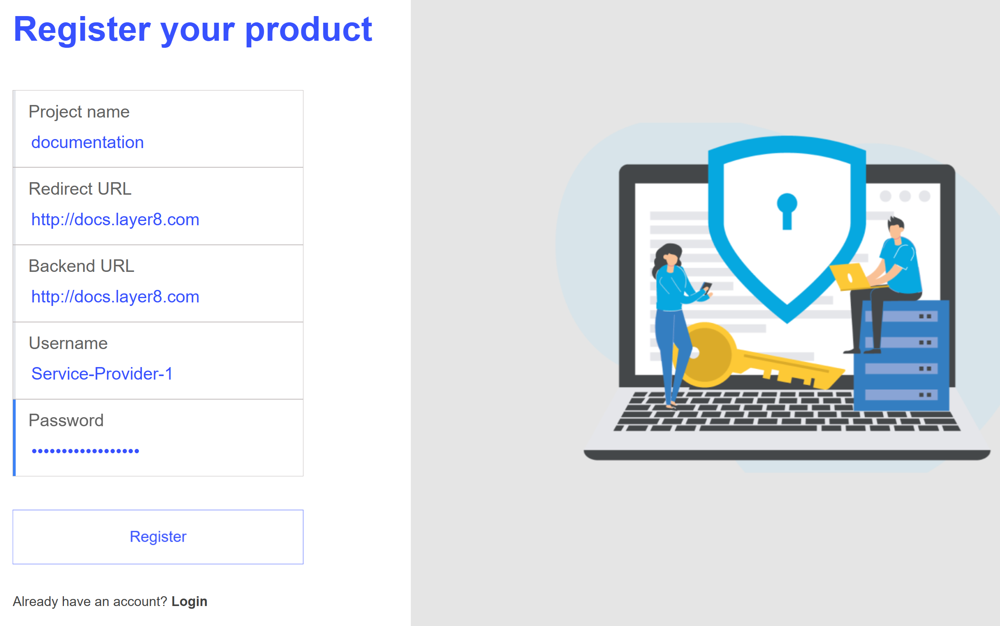
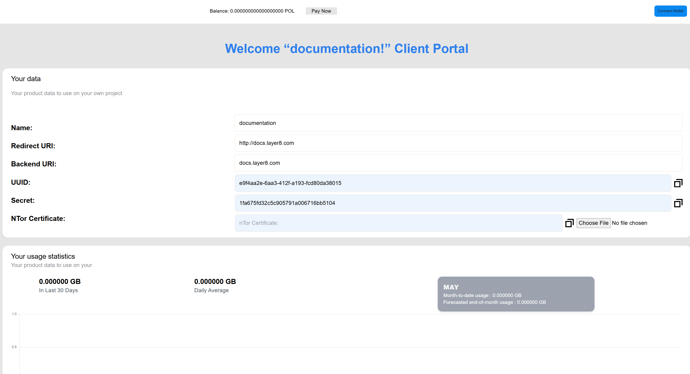
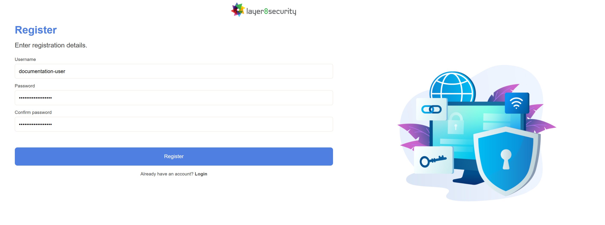
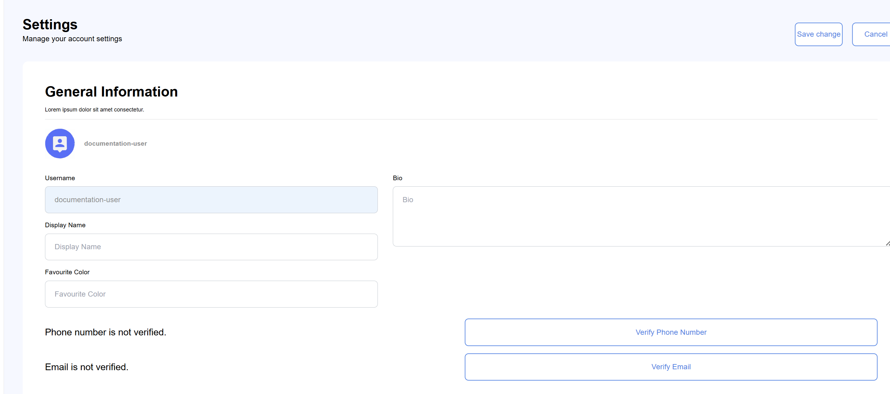
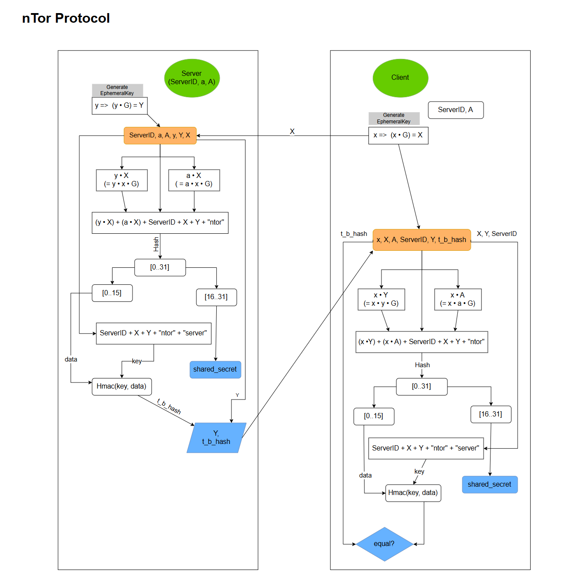

# Layer8: Project and Technical Overview. 

## Document Outline & Scope
Layer8 documentation is divided into 6 primary sections: a Project Overview as well as 5 large subsections representing the primary subcomponents of the system plus appendices. Each primary section is then divided further into subsections. A technical reader can jump to sections & subsections for reference. Interested parties can read the overview section alone to gain an understanding of the system at a high level and selectively read subsequent sections for further detail as necessary.

### *Primary Table of Contents*
- [1. Layer8 System Overview](#)
- [2. Authentication Server ](#)
- [3. Interceptor](#)
- [4. Forward Proxy](#)
- [5. Reverse Proxy](#)
- [6. Appendices](#)


### *Overview Table of Contents*
- [1. Overview](#document-outline--scope)
    - [1.1 Purpose Statement and vision](#11-purpose-statement-and-vision)
    - [1.2 System overview of the three layers](#12-system-overview-of-the-three-layers)
        - [1.2.1 User Layer](#121-user-layer)
        - [1.2.2 Proxy Layer](#122-proxy-layer)
        - [1.2.3 Service Provider Layer](#123-service-provider-layer)
    - [1.3 Primary Information Flows](#13-primary-information-flow-sequences)
        - [1.3.1 Tunnel Initiation](#131-tunnel-initiation)
        - [1.3.2 Standard Proxying](#132-standard-proxying)
        - [1.3.3 OAuth and OIDC Flows](#133-oauth-and-oidc-flows)
    - [1.4. Usecases](#14-usecases)

### 1.1 Purpose Statement and Vision

Layer8 is a system designed to anonymize the web traffic between a frontend Single Page Application and a backend Service Provider (SP) thereby obscuring the user’s IP and other identifying information. The following documentation describes an MVP implementation composed of several components that together separate a user’s identity (i.e., IP address) from their content choices online. The project name, “Layer8”, refers to the idea of adding an “eighth anonymization layer” to the Internet which is, according to the OSI, currently built on seven layers. How can a tiny start-up ever realistically accomplish such a task? In reality, Layer8 uses several mature web technologies and protocols in order to accomplish end-to-end encryption in the browser (WASM, OAuth, ECDH, etc.) It is, in fact, the giants of the web that have added an “eighth layer” to the internet. G&C is merely using it to accomplish anonymous E2E encryption in the browser.

In it's simplest representation Layer8 acts as simple VPN obscuring traffic.


*Figure 1: Layer8 at it's most basic abstraction: an in browser VPN on by default.*

The vision is of a DAO (or alternatively decentralized organization) to maintain a content delivery network of SPAs plus a distributed network of forward proxies that together form an anonymization platform enabling anonymity by default and building out part of the infrastructure necessary for self-sovereign identity on the internet. Though ambitious, successful applications like Signal & WhatsAPP demonstrate that centralization of a public key infrastructure can enable E2E anonymized encryption at a global scale.

Customers: any Service Provider that needs to, wants to, offer their user's anonymization by default. Usecases are found in Section 1.4 of this overview. 

## Basic Mechanism
Layer8 is, fundamentally just a VPN that runs within the browser by default. It uses Web Assembly in order to achieve its runtime efficiency. Ultimately, it provides a simple encapsulation / encryption service that wraps a user's of network traffic.


*Figure 2: Layer8 works by encapsulating and encrypting REST API request from a single page application. The greyed out boxes above are encrypted.*


The system is divided into three layers: User Layer, Proxy Layer, and Backend Layer.


*Figure 3: The layer8 system is best broken down and understood using three basic layers.*

To the Service Provider, the Layer8 system should be maximally transparent. Likewise, the frontend developer experience should be such that the Layer8 service can be implemented with an minimal of effort. The initiation of an encrypted tunnel occurs on SPA load and the act of proxying requires only the swapping of the native fetch for the Layer8 fetch function call.

```
//file: main.ts
import { initEncryptedTunnel, ServiceProvider } from "l8-intercept";
[...]
let forward_proxy_url = import.meta.env.VITE_FORWARD_PROXY_URL || 'http://localhost:6191';
let backend_url = import.meta.env.VITE_BACKEND_URL || 'http://localhost:3000';
[...]
if (import.meta.env.VITE_ENABLE_LAYER8 === 'true') {
    try {
        let providers = [ServiceProvider.new(backend_url)];
        initEncryptedTunnel(forward_proxy_url, providers);
    } catch (err) {
        throw new Error(`Failed to initialize encrypted tunnel: ${err}`);
    }
}
```
*Code Block 1: Initializing the Tunnel.*

```
//file: utils.ts
export async function InterceptorFetch(
    url: string,
    options: RequestInit = {}
): Promise<Response> {
    options.credentials = "include";
    if (import.meta.env.VITE_ENABLE_LAYER8 === 'true') {
        return (await InterceptorWasm.fetch(url, options)) as Response;
    } else {
        return (await fetch(url, options)) as Response;
    }
}
```
*Code Block 2: Wrapping the native browser fetch.*


```
//file: *.vue
import {InterceptorFetch} from "@/utils.ts";

function openPoem(id: string) {
    isLoading.value = true;
    InterceptorFetch(`${backend_url}/poems?id=${id}`)
        .then(response => {...})
        .then(data => {...})
        .catch(err => {...})
        .finally(() => {...});
}
```
*Code Block 3: Using the wrapped InterceptorWasm.fetch.*


## User Layer


*Figure 4: The user layer is where the user's real identity interacts and is known.*

The User layer is entirely contained within the user-agent (i.e., the browser). It's software components are the Service Provider's SPA and the Layer8 Interceptor. The Interceptor runs entirely within the browser and makes use of WASM as its runtime. The Interceptor is served automatically alongside the Service Provider's SPA. Technically, the Intercerptor could also be served independently from a CDN.

On load, the Interceptor is configured to initiate an encrypted tunnel with the Service Provider's backend using the nTOR protocol ([reference: https://cypherpunks.ca/~iang/pubs/ntor.pdf](https://cypherpunks.ca/~iang/pubs/ntor.pdf)). This completes a one-way authenticated encrypted tunnel between the user-agent and the Reverse Proxy allowing future messages to be proxied through the Forward Proxy and onto the Service Provider backend transparently. Once initiated, all REST API calls originating from the user-agent are passed through the Interceptor which uses the cryptographic material from the nTOR protocol to encrypt the user's request headers and body in order to envelop it. Specialized Interceptor headers are added to the envelop that will be stripped at the Forward Proxy. The user's content choices are now anonymized from the perspective of the Service Provider.  Layer8's CDN will register the user's IP address but none of their content choices. The Service Provider will register content choices but not the user's IP.

Globe and Citizen is responsible for providing and maintaining the code base for the Interceptor & Reverse Proxy even though instances of these are ultimately deployed and controlled by the user and Service Provider respectively.


## Proxy Layer


*Figure 5: The proxy layer is where the user's metadata is stored as zk-proofs and the Service Provider's credentials are stored and registered.*

The second layer is called the Proxy Layer. This is where Globe & Citizen maintains the infrastructure under its direct control. The proxy layer, the middle layer, is composed of the Forward Proxy, the Authentication Server  (Auth Server), and supporting infrastructure of the CDN.

Prior to any interaction between the user and the SP, the Auth Server registers SPs.



*Figure 6: Service Providers register permisionlessly.*



*Figure 7: Clients are given the necessary sercrets and IDs to configure deployements. Also shown, the Interface to upload the certificate as well as to pay for usage with crypto.*

During the initiation of the encrypted tunnel flow , the Forward Proxy is responsible for retrieving the nTOR Service Provider backend certificate.

The Auth Server is also responsible for registering users and producing and storing zk-proofs on behalf of the user (e.g., proof the user has a valid email address, phone number, passport, etc).



*Figure 8: Users register permisionlessly.*



*Figure 9: Users have the OPTION to verify metadata about themselves which can be selectively released during the OAuth flow.*

During the proxy flow, the Forward Proxy is responsible for stripping the Interceptors Headers, replacing them with dynamically generated and anonymized Forward Proxy headers and then proxying this information to the backend layer.

During the OAuth and `Login with Layer8` flows the proxy layer is responsible for authenticating the user and then releasing user approved metadata to the backend Service Provider. 

The middle layer has the responsibility of receiving encrypted messages from the Interceptor and, obviously, forwarding them onwards.

## Backend Layer


*Figure 10: The backend layer is built by the Service Provider and is the service that any user would otherwise expect to interact with.*

The third layer, the backend layer, is the Service Provider's backend servers as well as the Reverse Proxy. Globe & Citizen maintains the Reverse Proxy code but the SPs will deploy it.

During the initialize tunnel flow, the Reverse Proxy is responsible for decrypting the user's original request and forwarding it on to the Service Provider backend such that the Service Provider backend receives it as if it had been sent directly from the SPA.


## 1.3 Primary Information Flow Sequences
Making the system work, there are two primary information flows sequences: encrypted tunnel initiation and the proxying of encrypted traffic.

### 1.3.1 Encrypted Tunnel Initiation


*Figure 11: Encrypted tunnel initiation involves using the nTOR protocol that opens a connection between the Interceptor and the Reverse Proxy through the Forward Proxy.*

The nTOR protocol is maximally efficient achieving a shared, one way authenticated, cryptographic secret within a single `request` and `response` cycle. In this cryptographic scheme, the user remains anonymous but the Service Provider is authenticated. The scheme is dependent on the Layer8 Authentication Server having registered the Service Provider prior and having a copy of the Service Provider's nTOR static key certificate for distribution to users (see Firgure 7 above). 



*Figure 12: The nTOR Protocol mapped. See https://cypherpunks.ca/~iang/pubs/ntor.pdf. It provides one way authentication of the Service Provider authenticating to the user.*


### 1.3.2 Standard Proxying


*Figure 13: Once established. Requests can be sent from the Interceptor to the Reverse Proxy were they decrypted and then forwarded to the Service Provider's backend.*

Once a connection is established a triad of JSON Web Tokens (JWTs) is used to identify, and maintain, connections between the three layers: 
- `int_rp_jwt`: Interceptor Reverse Proxy JSON Web Token. 
- `int_fp_jwt`: Interceptor Forward Proxy JSON web Token.
- `fp_rp_jwt`: Ford Proxy, Reverse Proxy JSON Web Token. 

JSON Web Tokens were chosen For their extensibility (JWT payloads can be customized); robust options for securitization (see the myriad of IEEE JWT RFCs); and, scalability (JWT adhere to the principles of RESTful APIs).

### 1.3.3 OAuth and OIDC Flows


*Figure 14: How the three layers of the system interact during the OAuth flow.*

Layer8 makes use of the standard Oauth flow. Novelty is added by the fact that the layer8 Authentication Server  does not store user data directly. Rather, the Authentication Server  stores *ZK-proofs* of a user's data. By using the Oath flow, users can selectively release information to Service Providers. At the moment, the Authorization servers stores ZK-Proofs and user metadata in a centralized postgres database. Alternatively, IF the Authentication Sever made it's proofs accessible to the user, it can act as a certification authority for users thereby enabling Self Sovereign Identity.

The OAuth flow can be extended to use the Open ID Connect (OIDC) protocol enabling backends to offer "Sign In With Layer8." In other words, the use of the OIDC protocol allows Layer8 to act as a federated identity provider both authenticating and authorizing users according to the same flow now standard on the Internet already.


## 1.4. Usecases

### 1.4.1 - Anonymous Voting
- AS A: DAPP developer,
- I WANT TO: offer my users On chain certified anonymous voting. 
- WHEN I: program a pop up window that operates as a single page appication,
- I SEE THAT: an encrypted tunnel is automatically opened and all future traffic from this window is E2E encrypted, anonymizing my users and their voting preferences.

### 1.4.2 - Chatbot anonymity
- AS A: User of an online chatbot,
- I WANT TO: know that the content of my conversation is anonymous and E2E such that even the Service Provider of the chat bot doesn't know my true identity. 
- WHEN I: Navigate to a Service Provider's website (e.g., online AI lawyer, AI doctor, etc.),
- I SEE THAT: I log in with my Layer8 OIDC credentials reassuring me. 

### 1.4.3 - Self Sovereign Identity
- AS A: User of Layer8
- I WANT TO: Prove to a Service Provider that I have a cellphone number and a valid ID stating I'm above age 18 without actually uploading my ID.
- WHEN I: Choose to release my saved metadata zk-proofs to a Service Provider,
- I SEE THAT: The Service Provider accepts my released ZK-Proofs without requiring any further personal identifying information.

### 1.4.4 - Confidentiality Protection and Guarantees
- AS A: Developer of an online media platform,
- I WANT TO: Analyze, parse, and otherwise use usage data on my website without fear of privacy regulation infractions.
- WHEN I: Build on the Layer8 platform,
- I SEE THAT: I can build what feels and appears to be a normal SPA while having the assurances that all of my user's data has been appropriately anonymized and it is impossible for me to release (or leak) there personal identifying information. 