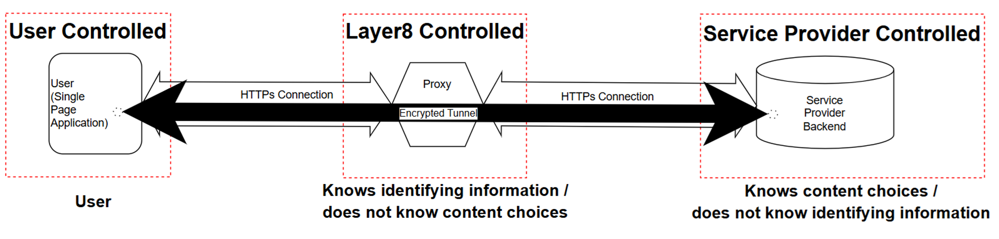
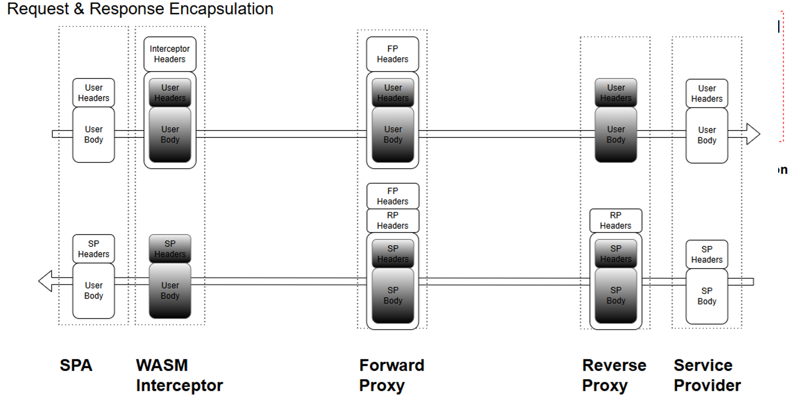
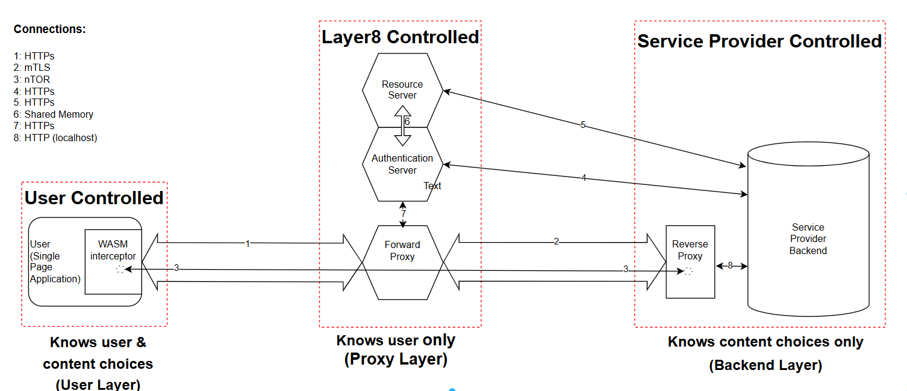
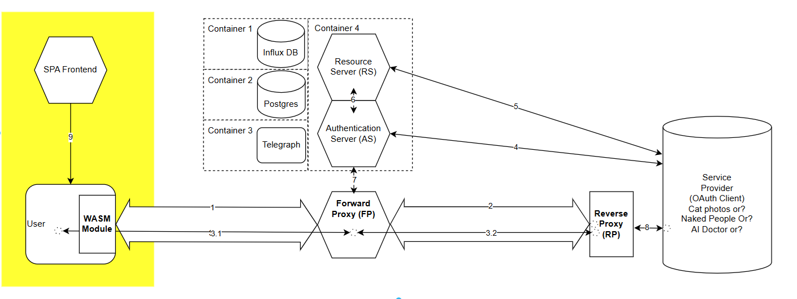
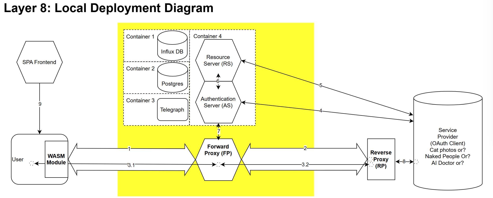
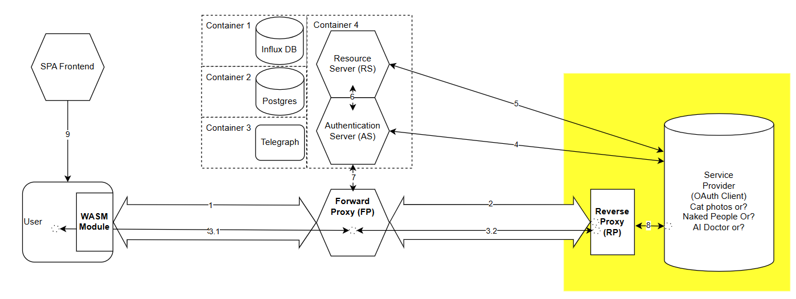
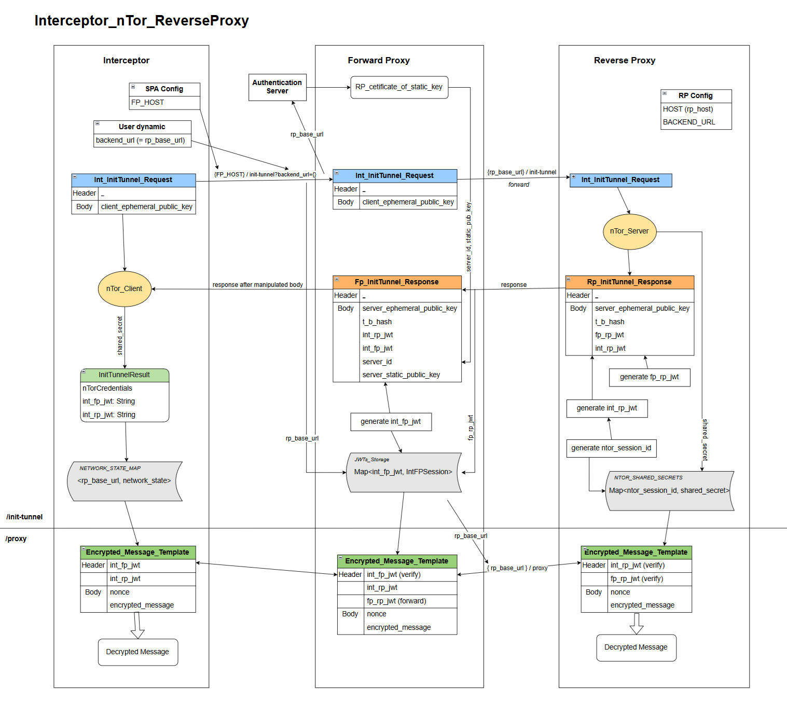
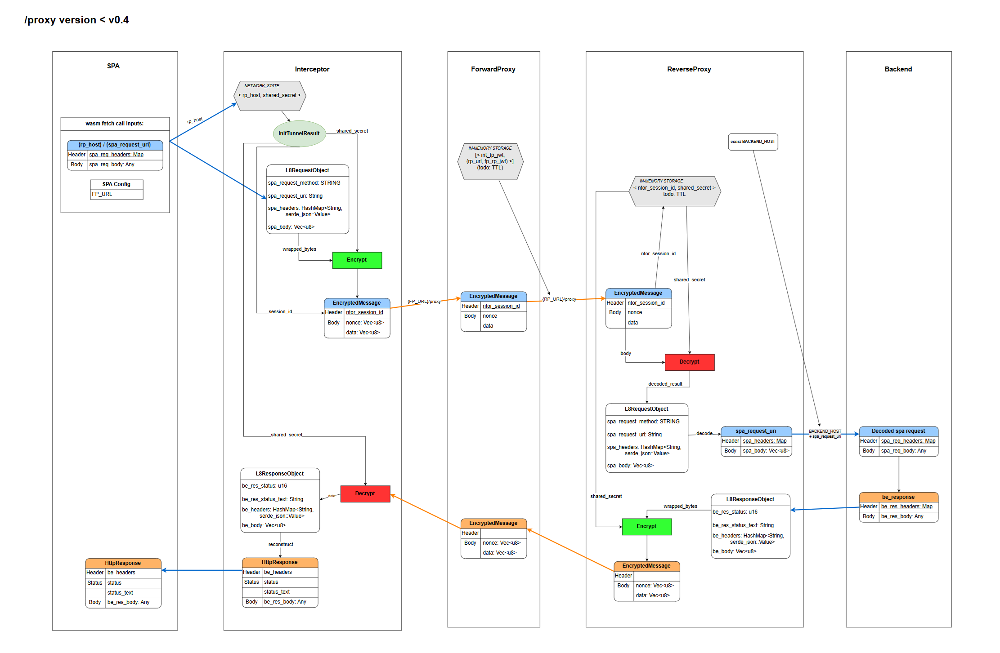
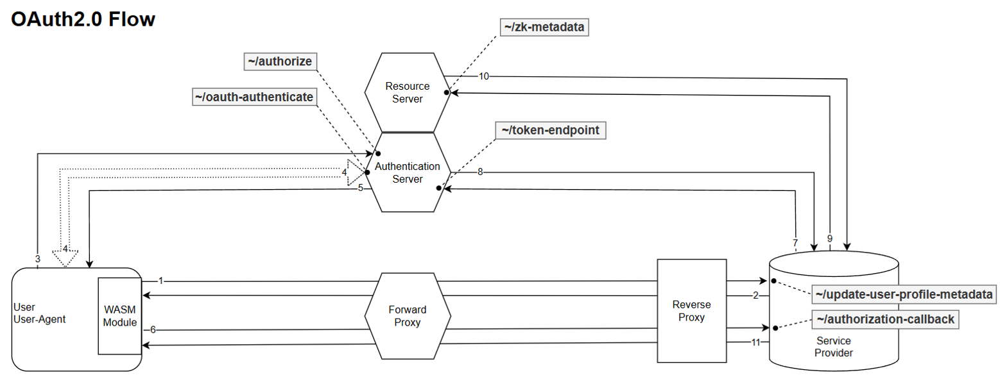

# Layer 8: Project and Technical Overview. 

## Document Outline & Scope
This document is divided into XXX primary sections: a Project Overview as well as 4 large subsections representing the primary subcomponents of the system plus appendices.

A technical reader can jump to sections for reference. Interested parties can read the overview section alone to gain an understanding of the system at a high level selectively reading subsequent sections for further detail as necessary.

### *Primary Table of Contents*
- [1. Overview](#)
- [2. Authentication Server](#)
- [3. Interceptor](#)
- [4. Forward Proxy](#)
- [5. Reverse Proxy](#)
- [6. Appendices](#)


### *Overview Table of Contents*
- [1. Overview](#)
    - [1.1 Purpose Statement and vision](#)
    - [1.2 System overview of the three layers](#)
        - [1.2.1 User Layer](#)
        - [1.2.2 Proxy Layer](#)
        - [1.2.3 Service Provider Layer](#)
    - [1.3 Primary Information Flows](#)
        - [1.3.1 Tunnel Initiation](#)
        - [1.3.2 Standard Proxying](#)
        - [1.3.3 OAuth and OIDC Flows](#)
    - [1.4. Usecases](#)

### 1.1 Purpose Statement and Vision

Layer8 is a system designed to anonymize the web traffic between a frontend Single Page Application and a backend Service Provider (SP) thereby obscuring the user’s IP and other identifying information. The following specification describes an MVP implementation composed of several components that, together, separate a user’s identity (i.e., IP address) from their content choices online. The project name, “Layer8”, refers to the idea of adding an “eighth anonymization layer” to the Internet which is, according to the OSI, currently built on seven layers. How can a tiny start-up ever realistically accomplish such a task? In reality, Layer8 uses several mature web technologies and protocols in order to accomplish end-to-end encryption in the browser (WASM, OAuth, ECDH, etc.). It is, in fact, the giants of the web that have added an “eighth layer” to the internet. G&C is merely using it to accomplish anonymous E2E encryption in the browser.

In it's simplest representation Layer8 acts as simple VPN obscuring traffic.


*Figure 1: Layer8 at it's most basic abstraction.*

The vision is of a DAO (or alternatively decentralized organization) to maintain a content delivery network of SPAs and distributed network of forward proxies that together form an anonymization platform enabling anonymity by default and building out part of the infrastructure necessary for self-sovereign identity on the internet. Though ambitious, applications like Signal & WhatsAPP demonstrate that centralization of a public key infrastructure can enable E2E anonymized encryption.

Customers: any service provider that needs to, wants to, offer their user's anonymization by default. Usecases are found in Section 1.4 of this overview. 

## Basic Mechanism
Layer8 is, fundamentally just a virtual private network provider that runs within the browser using Web Assembly in order to achieve its runtime efficiency. Ultimately. It provides a simple encapsulation / encryption service that wraps a user's of network traffic.



*Figure 2: Layer8 works by encapsulating and encrypting RESTapi request from a single page application.*


The system is devided into three layers: User Layer, Proxy Layer, and Backend Layer.



*Figure 3: The layer8 system is best broken down and understood using three basic layers.*

To the Service Provider, the layer8 system should be maximally transparent. Likewise, the frontend developer experience should be such that the Layer8 service can be implemented with an minimal of effort. The initiation of an encrypted tunnel occurs on SPA load and the Fact of proxying requires only swapping the native fetch for the layer 8 fetch function.

```
//file: main.ts
import { initEncryptedTunnel, ServiceProvider } from "l8-intercept";
[...]
let forward_proxy_url = import.meta.env.VITE_FORWARD_PROXY_URL || 'http://localhost:6191';
let backend_url = import.meta.env.VITE_BACKEND_URL || 'http://localhost:3000';
[...]
if (import.meta.env.VITE_ENABLE_LAYER8 === 'true') {
    try {
        let providers = [ServiceProvider.new(backend_url)];
        initEncryptedTunnel(forward_proxy_url, providers);
    } catch (err) {
        throw new Error(`Failed to initialize encrypted tunnel: ${err}`);
    }
}
```
*Code Block 1: Initializing the Tunnel.*

```
//file: utils.ts
export async function interceptorFetch(
    url: string,
    options: RequestInit = {}
): Promise<Response> {
    options.credentials = "include";
    if (import.meta.env.VITE_ENABLE_LAYER8 === 'true') {
        return (await interceptorWasm.fetch(url, options)) as Response;
    } else {
        return (await fetch(url, options)) as Response;
    }
}
```
*Code Block 2: Wrapping the native browser fetch.*


```
//file: *.vue
import {interceptorFetch} from "@/utils.ts";

function openPoem(id: string) {
    isLoading.value = true;
    interceptorFetch(`${backend_url}/poems?id=${id}`)
        .then(response => {...})
        .then(data => {...})
        .catch(err => {...})
        .finally(() => {...});
}
```
*Code Block 3: Using the wrapped interceptorWasm.fetch.*


## User Layer


*Figure 4: The user layer is where the user's real identity interacts and is known.*

The User layer is entirely contained within the user-agent (i.e., the browser). It's software components are the Service Provider's (SP) single page application (SPA) and the Interceptor. The Interceptor runs entirely within the browser and makes use of WASM to run. The Interceptor is served with the Service Provider's SPA.

On load, the Interceptor is configured to initiate an encrypted tunnel with the SP's backend using the nTOR protocol ([reference](https://cypherpunks.ca/~iang/pubs/ntor.pdf)). This completes a one-way authenticated encrypted tunnel between the user-agent and the Reverse Proxy allowing future messages to be proxied through the Forward Proxy and onto the SP backend transparently. Once initiated, all REST API calls originating from the user-agent are passed through the Interceptor which uses the cryptographic material from the nTOR protocol to encrypt the user's request headers and body in order to envelop it. Specialized Interceptor headers are added to the envelop that will be stripped at the Forward Proxy. The user's content choices are now anonymized from the perspective of the Service Provider. Layer8's CDN will register the user's IP address but none of their content choices. The SP will register content choices but not the user's IP.

Globe and Citizen is responsible for providing and maintaining the code base for the Interceptor & RP even though instances of these are ultimately deployed and controlled by the user and SP respectively.


## Proxy Layer



*Figure 5: The proxy layer is where the user's metadata is stored as zk-proofs and the SP's credentials are stored and registered.*

The second layer is called the Proxy Layer. This is where Globe & Citizen maintains the infrastructure under its direct control. The second layer, the middle layer, is composed of the Forward Proxy (FP), the Authentication Server (Auth Server), and supporting infrastructure of the CDN.

Prior to any interaction between the user and the SP, the Auth Server registers SPs.

The Auth Server is also responsible for registering users and producing and storing zk-proofs on behalf of the user (e.g., proof the user has a valid email address, phone number, passport, etc).

During the initiation of the encrypted tunnel flow , the FP is responsible for retrieving the nTOR SP backend certificate.

During the proxy flow, the FP is responsible for stripping the Interceptors Headers, replacing them with dynamically generated and anonymized FP headers and then proxying this information to the backend layer.

During the OAuth and `Login with Layer8` flows the middle layer is responsible for authenticating the user and then releasing user approved metadata to the backend service provider.

The middle layer has the responsibility of receiving encrypted messages from the

## Backend Layer



*Figure 6: The backend layer is built by the SP and is the service that any user would otherwise expect to interact with.*

In the third layer is the SP's backend servers as well as the Reverse Proxy (RP). Globe & Citizen maintains the RP code but the SPs will deploy it.

During the initialize tunnel flow, the RP is responsible for decrypting the user's original request and forwarding it on to the SP backend such that the SP backend receives it as if it had been sent directly from the SPA.

During the proxy tunnel flow, the RP is responsible for adding those headers necessary to...


Flows: just show the flows and figure the captions


## 1.3 Primary Information Flow Sequences
As effectively an in browser VPN, there are two primary information flows sequences: Encrypted Tunnel initiation and the proxying of encrypted traffic.

### 1.3.1 Tunnel Initiation


*Figure 7: Encrypted tunnel initiation involves using the nTOR protocol That opens a connection between the interceptor and the Reverse Proxy through the Forward Proxy.*

The nTOR protocol is maximally efficient achieving a shared, one way authenticated, cryptographic secret within a single `request` and `response` cycle. In this cryptographic scheme, the user remains anonymous but the SP is authenticated. The scheme is dependent on the Layer8 Authentication Server having registered the SP prior and having a copy of the Service Provider's nTOR static key certificate for distribution to users. 

### 1.3.2 Standard Proxying


*Figure 8: Once established. Requests can be sent from the Interceptor to the RP were they decrypted and then forwarded to the Service Provider's backend.*

Once a connection is established a triad of JSON Web Tokens (JWTs) is used to identify, and maintain, connections between the three layers: 
- `int_rp_jwt`: Interceptor Reverse Proxy JSON Webb Token. 
- `int_fp_jwt`: Interceptor Forward Proxy JSON web Token.
- `fp_rp_jwt`: Ford Proxy, Reverse Proxy JSON Webb Token. 

JSON Web Tokens were chosen For their extensibility (JWT payloads can be customized), robust options for securitization (see the myriad of IEEE JWT RFCs), and scalability (JWT adhere to the principles of RESTful APIs).

### 1.3.3 OAuth and OIDC Flows


*Figure: 9: How the three layers of the system interact during the OAuth flow.*

Layer 8 makes use of the standard Oauth flow. Novelty is added by the fact that the layer8 authentication server does not store user data directly. Rather, the authentication server stores *ZK-proofs* of a user's data. By using the Oath flow, users can selectively release information to Service Providers. At the moment, the Authorization servers stores ZK-Proofs and user metadata in a centralized postgres database. Alternatively, if the Authentication Sever made it's proofs accessible to the user, it can act as a certification authority for users thereby enabling Self Sovereign Identity.

The OAuth flow can be extended to use the Open ID Connect (OIDC) protocol enabling backends to offer "Sign in With Layer8." In other words, the use of the OIDC protocol allows Layer 8 to act as a federated identity provider both authenticating and authorizing users according to the same flow now standard on the Internet already.


## 1.4. Usecases

