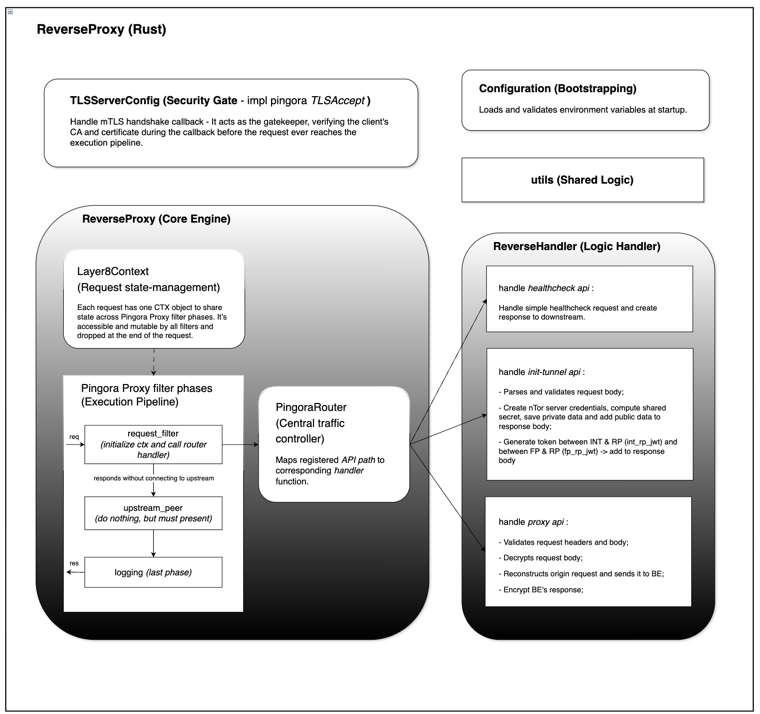

# Reverse Proxy - Technical Architecture & Design Document (Draft)

**Implementation Language:** Rust | **Proxy Engine:** Pingora

Assuming familiarity with the Layer8 architecture and the role of the ReverseProxy, this document provides a technical
overview of the ReverseProxy's design, architecture, and implementation details. It serves as a reference for developers
working on the ReverseProxy component, outlining its responsibilities, project structure, configuration options, and key
implementation details.

### *Table of Contents*

- [1. Overview](#1-overview)
- [2. Project Structure](#2-project-structure)
- [3. Deployment Diagram](#3-deployment-diagram)
- [4. Configuration](#4-configuration)
- [5. Request Lifecycle (Pingora Proxy Implementation)](#5-request-lifecycle-pingora-proxy-implementation)
    - [5.1. Layer8Context (Request State Management)](#51-layer8context-request-state-management)
    - [5.2. `request_filter` Phase](#52-request_filter-phase)
    - [5.3. `logging` Phase](#53-logging-phase)
- [6. API Handlers](#6-api-handlers)
    - [6.1. NTor Session Management](#61-ntor-session-management)
    - [6.2. `/init-tunnel` Request](#62-init-tunnel-request)
        - [6.2.1. Description](#621-description)
        - [6.2.2. Function Signature](#622-function-signature)
        - [6.2.3. Params](#623-params)
        - [6.2.4. Returns](#624-returns)
        - [6.2.5. Errors](#625-errors)
        - [6.2.6. Side Effects](#626-side-effects)
        - [6.2.7. Flow](#627-flow)
    - [6.3. `/proxy` Request](#63-proxy-request)
        - [6.3.1. Description](#631-description)
        - [6.3.2. Function Signature](#632-function-signature)
        - [6.3.3. Params](#633-params)
        - [6.3.4. Returns](#634-returns)
        - [6.3.5. Errors](#635-errors)
        - [6.3.6. Side Effects](#636-side-effects)
        - [6.3.7. Flow](#637-flow)
    - [6.4. `/healthcheck` Request](#64-healthcheck-request)
- [7. mTLS Callback](#7-mtls-callback)
    - [7.1. TLS Credential Loading](#71-tls-credential-loading)
    - [7.2. Dynamic TLS Reload](#72-dynamic-tls-reload)
    - [7.3. Handshake Configuration](#73-handshake-configuration)
    - [7.4. Client Certificate Verification](#74-client-certificate-verification)
    - [7.5. Notes / Limitations](#75-notes--limitations)

## 1. Overview

is a Rust-based network proxy built on the Pingora proxy framework. It sits in front of the SPA Backend Server (BE),
receiving requests from ForwardProxy (FP). The RP terminates the nTor session handshake (`/init-tunnel`), decrypts
incoming `/proxy` requests, forwards them to the backend, encrypts responses back to the client, enforces mTLS for
secure communication, and provides a healthcheck endpoint for monitoring.



*Figure 1: High-level architecture diagram of the ReverseProxy.*

Its responsibilities include:

- **nTor Session Management:** Establishing and managing nTor sessions with clients, including key agreement and session
  tracking.
- **Request Interception & Handling:** Intercepting incoming requests, routing them to the appropriate handlers based on
  the endpoint, and processing them according to the defined logic (e.g., decrypting proxy requests, forwarding to
  backend, encrypting responses).
- **mTLS Enforcement:** Enforcing mutual TLS for all incoming connections, verifying client certificates against a
  trusted CA, and securely loading TLS credentials.

<div style="page-break-after: always;"></div>

## 2. Project Structure

The ReverseProxy project is organized into the following modules:

```
├── `reverse-proxy`: Intercept, wrap and decrypt/encrypt the entire request/response.
│   ├── `src`: The root directory.
│   │   ├── `handler`: Contains the logic for processing incoming network requests.
│   │   │   ├── `common`: Centralized repository for shared constants, error types, and common data structures used across handlers.
│   │   │   ├── `healthcheck`: Implements the `/healthcheck` endpoint to monitor service availability and internal status.
│   │   │   ├── `init_tunnel`: Manages the `/init-tunnel` handshake logic, establishing secure communication paths for clients and backends.
│   │   │   ├── `proxy`: Handles the logic for the `/proxy` endpoint, responsible for decrypting incoming payloads, 
                    and re-encrypting subsequent responses.
│   │   │   └── `mod.rs`: The module declaration file that exports and organizes the handler sub-modules.
│   │   ├── `config.rs`: Manages application settings, environment variables, and the loading of runtime configurations.
│   │   ├── `tls_conf.rs`: Implements the `TLS_Accept` interface to enforce mTLS (Mutual TLS) verification and handle authentication callbacks.
│   │   ├── `proxy.rs`: The core engine of the service; acts as the primary traffic interceptor and 
                dispatches requests to the appropriate handlers based on the endpoint.
│   │   └── `main.rs`: The entry point of the application; initializes the asynchronous runtime, loads TLS certificates,
                and starts the main event loop to listen for incoming connections.
│   ├── Dockerfile
│   ├── .env.dev
│   ├── .env.docker
│   ├── build.rs
│   └── Cargo.toml
│
├── `utils` — Shared helpers and cross-crate utilities.
│
├── `pingora-router`
│   ├── `src`
│   │   ├── `ctx.rs` — Public `Layer8Context` struct: per-request state, auth claims, and tracing fields.
│   │   ├── `mod.rs` — Router public API and layer composition; documents exported traits and types.
│   │   └── ...
```

<div style="page-break-after: always;"></div>

## 3. Deployment Diagram

[will be added later]
<br>

## 4. Configuration

All configuration is loaded from environment variables at startup (defined in `.env.dev` for development
and `.env.docker` for Docker deployment) and deserialized into `RPConfig`. The struct is composed of
flattened sub-configs.
<br>

### 4.1. Server (`RPConfig`)

| Variable              | Type     | Example              | Description                                                       |
|-----------------------|----------|----------------------|-------------------------------------------------------------------|
| `LISTEN_ADDRESS`      | `String` | `localhost`          | Address the proxy listens on.                                     |
| `LISTEN_PORT`         | `u16`    | `6193`               | Port the proxy listens on.                                        |
| `PATH_TO_SERVER_CONF` | `String` | `../server_conf.yml` | Path to the server routing/config file used by the Reverse Proxy. |

---
<br>

### 4.2. Logging (`LogConfig`)

| Variable       | Type     | Example             | Description                                                            |
|----------------|----------|---------------------|------------------------------------------------------------------------|
| `LOG_LEVEL`    | `String` | `trace`             | Verbosity level (`trace`, `debug`, `info`, `warn`, `error`).           |
| `LOG_FORMAT`   | `String` | `plain`             | Output format. Defaults to `json` unless set to `plain`.               |
| `LOG_PATH`     | `String` | `console`           | Set to `console` for stdout, or provide a folder path for file output. |
| `LOG_FILENAME` | `String` | `reverse-proxy.log` | Log filename. Required when `LOG_PATH` is not `console`.               |

---
<br>

### 4.3. Handler (`HandlerConfig`)

| Variable                        | Type     | Example                            | Description                                                   |
|---------------------------------|----------|------------------------------------|---------------------------------------------------------------|
| `NTOR_SERVER_ID`                | `String` | `ReverseProxyServer`               | Reverse Proxy nTor server identifier.                         |
| `NTOR_STATIC_SECRET`            | `String` | `this is 32-byte nTorStaticSecret` | Static secret used by the nTor server.                        |
| `JWT_VIRTUAL_CONNECTION_SECRET` | `String` | `this is 32-byte rp's jwt secret.` | Signing secret for Reverse Proxy virtual connection JWTs.     |
| `JWT_EXP_IN_HOURS`              | `i64`    | `24`                               | Expiry duration for issued JWT tokens, in hours.              |
| `FORWARD_PROXY_URL`             | `String` | `http://localhost:6191`            | Base URL for the Forward Proxy the Reverse Proxy connects to. |
| `BACKEND_URL`                   | `String` | `http://localhost:3000`            | Backend service URL that the Reverse Proxy routes to.         |

---
<br>

### 4.4. Proxy & CORS (`ProxyConfig`)

| Variable                 | Type          | Example                     | Description                                    |
|--------------------------|---------------|-----------------------------|------------------------------------------------|
| `CORS_ALLOW_CREDENTIALS` | `bool`        | `true`                      | Whether to allow credentials in CORS requests. |
| `CORS_ALLOW_ORIGINS`     | `Vec<String>` | `http://localhost:6191,...` | Comma-separated list of allowed CORS origins.  |

---
<br>

### 4.5. TLS (`TLSConfig`)

| Variable     | Type     | Example               | Description                                         |
|--------------|----------|-----------------------|-----------------------------------------------------|
| `ENABLE_TLS` | `bool`   | `true`                | Enables mutual TLS (mTLS) for relevant connections. |
| `CA_PATH`    | `String` | `./certs/root_ca.crt` | Path to the CA certificate for mTLS verification.   |
| `CERT_PATH`  | `String` | `./certs/server.crt`  | Path to the ReverseProxy certificate.               |
| `KEY_PATH`   | `String` | `./certs/server.key`  | Path to the ReverseProxy private key.               |

---

## 5. Request Lifecycle (Pingora Proxy Implementation)

#### Source: `layer8-backbone/reverse-proxy/src/proxy.rs`

Unlike the ForwardProxy, the ReverseProxy handles the entire request within a single Pingora phase (`request_filter`)
and does not proceed through the full Pingora lifecycle.

Flow:

1. Incoming request enters `request_filter`
2. Request is fully read and routed to a handler
3. Handler processes the request (decrypts, validates, and forwards to backend)
4. Response is constructed (including headers, body, and cookies)
5. Response is written back to the client and the request terminates (no further phases)

---

Even though the ReverseProxy struct implements the Pingora `HttpProxy` trait, it does not utilize the
standard [lifecycle filter phases](https://github.com/cloudflare/pingora/blob/main/docs/user_guide/phase.md). Instead,
only the `request_filter` phase is used as the primary interception point.

During `request_filter`, the proxy:

- intercepts incoming requests
- reads the full request body
- updates the request context with relevant state
- routes the request to one of three supported API handlers:
    - `POST /init-tunnel`
    - `POST /proxy`
    - `GET /healthcheck`

Each handler independently processes the request and constructs a complete response. This includes:

- performing cryptographic operations (e.g., nTor decryption/encryption)
- forwarding reconstructed requests to the backend service
- building the final response (status, headers, body, cookies)

Once the handler returns an `APIHandlerResponse`, the proxy sets response headers (including CORS) and writes the
response body back to the client. The request processing terminates at this point without proceeding to other Pingora
phases or connecting to an upstream server via the standard pipeline.

<br>

### 5.1. Layer8Context (Request State Management)

Each inbound request is assigned a single `Layer8Context` (CTX) object. This object acts as a shared, mutable state
container that flows through the request processing lifecycle.

- One CTX object is created per request.
- Accessible and mutable by all participating components during request processing.
- Automatically dropped at the end of the request lifecycle — no manual cleanup required.

In the **ReverseProxy**, requests are not forwarded to the backend using the standard Pingora upstream flow. Instead,
API handlers independently construct and send requests to the backend.

`Layer8Context` is used to:

- store request data (headers, body, metadata)
- pass state between the proxy and handlers
- assist in constructing the final response

The CTX serves as a flexible state container that enables handler-driven request processing.

<br>

### 5.2. `request_filter` Phase

The `request_filter` phase is the main interception point for all incoming requests. It performs the following steps:

1. Extract the request path and method to determine the appropriate handler.
2. Read the entire request body into memory (up to a configured max size) and store it in the CTX.
3. Route the request to the appropriate handler:
    - `POST /init-tunnel` → `ReverseHandler::handle_init_tunnel()`
    - `POST /proxy` → `ReverseHandler::handle_proxy_request()`
    - `GET /healthcheck` → `ReverseHandler::handle_healthcheck()`
4. Receive the `APIHandlerResponse` from the handler (status, body, cookies).
5. Set response headers (including CORS) based on configuration and handler output.
6. Write the response body back to the client.
7. Terminate processing without proceeding to other Pingora phases.

> Note: Connections to backend services are established directly by the API handlers (e.g., `handle_proxy_request()`),
> not through Pingora’s upstream pipeline.

<br>

### 5.3. `logging` Phase

The `logging` phase runs after the request has been fully processed. It is used to log request and response details for
monitoring and debugging purposes.

Typical logged information includes:

- request path and method
- response status code
- relevant context or tracing data

<div style="page-break-after: always;"></div>

## 6. API Handlers

#### Source: `layer8-backbone/reverse-proxy/src/handler/mod.rs`

`ReverseHandler` is the ReverseProxy’s HTTP API entrypoint and orchestrator for:

- establishing an **nTor key agreement session** (`/init-tunnel`)
- accepting **encrypted proxy requests**, forwarding them to the configured backend, and returning an **encrypted
  response** (`/proxy`)
- providing a simple service **healthcheck** endpoint (`/healthcheck`)

It delegates validation / parsing / crypto operations to sub-handlers:

- `InitTunnelHandler` in `reverse-proxy/src/handler/init_tunnel/*`
- `ProxyHandler` in `reverse-proxy/src/handler/proxy/*`
- `reverse-proxy/src/handler/healthcheck/*`

The handler is initialized from `RPConfig` via `ReverseHandler::new(config: RPConfig)`, extracting:

- `config: HandlerConfig` (per-handler config, including `backend_url`, `ntor_server_id`, `jwt_exp_in_hours`, etc.)
- `jwt_secret: Vec<u8>` (from `config.handler.jwt_virtual_connection_secret`)
- `ntor_static_secret: [u8; 32]` (from `config.handler.ntor_static_secret`)

<br>

### 6.1. NTor Session Management

Sessions are stored in-memory using a thread-local `HashMap` with `ntor_session_id` as the key. Each session contains
the negotiated nTor `shared_secret` used to decrypt `/proxy` requests and encrypt `/proxy` responses.

*Storage Structure*

- **Type:** `thread_local! { static NTOR_SHARED_SECRETS: Mutex<HashMap<String, Vec<u8>>> = ... }`
- **Key:** `ntor_session_id` (unique per session; generated by `new_uuid()`)
- **Value:** `Vec<u8>` nTor `shared_secret` derived by `NTorServer`
- **Thread Safety:** `Mutex<>` allows safe access within a thread. Because this is `thread_local`, storage is *
  *per-thread** (not shared across threads).

*Session Lifecycle*

- **Creation:** Created in `handle_init_tunnel()` after successful tunnel initialization (server accepts the client init
  message and derives a shared secret).
- **Storage:** Inserted into `NTOR_SHARED_SECRETS` with `ntor_session_id` as the key.
- **Retrieval:** Retrieved via `get_ntor_shared_secret()` during `handle_proxy_request()` to decrypt/encrypt proxy
  traffic.
- **Expiration:** Implicitly bounded by `jwt_exp_in_hours` because `ntor_session_id` is delivered via `int_rp_jwt` (
  TODO: enforce expiration on the shared secret map).
- **Cleanup:** Currently not implemented; required for production to prevent memory bloat (e.g., periodic cleanup of
  expired sessions).

> **Note:** Because sessions are stored `thread_local`, a session created on one worker thread may not be visible to
> another. Multi-instance deployments will also require sticky routing or a shared backing store.

<br>

### 6.2. `/init-tunnel` Request

#### 6.2.1. Description

Validates the tunnel initialization request and performs the server-side nTor session bootstrap.
Processes incoming tunnel initialization requests from clients, performs key exchange, generates session tokens, and
stores the shared secret for subsequent proxy requests.

#### 6.2.2. Function Signature

```ignore
pub async fn handle_init_tunnel(&self, ctx: &mut Layer8Context) -> APIHandlerResponse
```

#### 6.2.3. Params

- `ctx: &mut Layer8Context`: A mutable reference to the Layer8Context containing the incoming HTTP request data,
  headers, body, and correlation ID.

#### 6.2.4. Returns

APIHandlerResponse:

- `StatusCode::OK (200)`        — Encrypted tunnel initialization response containing server public key, t_b_hash,
  int_rp_jwt, fp_rp_jwt.
- `StatusCode::BAD_REQUEST (400)` — If the public key length is invalid or request body validation fails.

#### 6.2.5. Errors

- Request body validation fails (e.g., missing or malformed public key).
- JWT creation errors may result in malformed or empty tokens.

#### 6.2.6. Side Effects

- Stores the nTor shared secret (keyed by `ntor_session_id`) into `NTOR_SHARED_SECRETS` thread-local storage for use in
  later proxy requests.
- Emits a tracing info! log with the `correlation_id` and newly created `ntor_session_id`.

<br>

#### 6.2.7. Flow

1. Extract `correlation_id` from ctx for tracing.
2. Validate request body via `InitTunnelHandler::validate_request_body`:
    - must be valid `InitEncryptedTunnelRequest` JSON
    - client ephemeral key is included and valid format (32-byte length)
3. Initialize NTorServer (server-side of nTor protocol) instance using config:
    - `ntor_server_id` (identifier for this RP’s nTor server)
    - `ntor_static_secret` (static secret used by the RP for nTor)
4. Accept client init-session request:
    - Construct `InitSessionMessage` from the client's ephemeral public key
    - Call `ntor_server.accept_init_session_request(...)` to perform the nTor handshake, which generates:
        - **RP ephemeral public key** — sent back to client so it can derive the shared secret
        - **`t_b_hash`** — cryptographic proof sent to client to verify the handshake
        - **`shared_secret`** — the encryption key derived from both parties' ephemeral keys (kept server-side for
          decrypting future `/proxy` requests)
5. Generate session + credentials for subsequent steps:
    - Create a new `ntor_session_id` (UUID)
    - Create `int_rp_jwt` containing `ntor_session_id` in JWT claims for INT -> RP communication
    - Create `fp_rp_jwt` for FP → RP communication
6. Store the new session in-memory:
    - Key: `ntor_session_id`
    - Value: `shared_secret` bytes derived from the nTor handshake
7. Return `InitEncryptedTunnelResponse` for the client to complete tunnel setup

<br>

### 6.3. `/proxy` Request

#### 6.3.1. Description

Handles proxy requests with nTor encryption/decryption. Processes encrypted proxy requests from clients, decrypts them
using the nTor shared secret, forwards them to the backend, and returns the encrypted backend response to the client.

#### 6.3.2. Function Signature

```ignore
pub async fn handle_proxy_request(&self, ctx: &mut Layer8Context) -> APIHandlerResponse
```

#### 6.3.3. Params

- `ctx: &mut Layer8Context` — Mutable reference to the Layer8 request context, containing
  HTTP request headers, body, query parameters, and response utilities.

#### 6.3.4. Returns

- `APIHandlerResponse` with `StatusCode::OK` (200) and an encrypted response body on success.
- `APIHandlerResponse` with `StatusCode::UNAUTHORIZED` (401) if the JWT is invalid or the session ID is not found.
- `APIHandlerResponse` with `StatusCode::BAD_REQUEST` (400) if request validation fails.
- Other error status codes if decryption, backend communication, or encryption fails.

#### 6.3.5. Errors

- JWT validation failure in `ProxyHandler::validate_request_headers`
- Session ID not found in `NTOR_SHARED_SECRETS` thread-local storage
- Request body validation failure in `ProxyHandler::validate_request_body`
- nTor decryption failure in `ProxyHandler::decrypt_request_body`
- Backend communication failure in `ProxyHandler::rebuild_user_request`
- Response encryption failure in `ProxyHandler::encrypt_response_body`

#### 6.3.6. Side Effects

- Reads from `NTOR_SHARED_SECRETS` thread-local storage to retrieve the shared secret by session ID.
- Sends an HTTP request to the configured backend URL.
- Inserts a `set-cookie` header into the response if the backend returns one.

#### 6.3.7. Flow

1. Validate required JWT headers via `ProxyHandler::validate_request_headers()`:
    - Verify `fp_rp_jwt` header (must be present, valid and not expired)
    - Verify `int_rp_jwt` header (must be present, valid and not expired, contains `ntor_session_id` claim)
2. Extract `ntor_session_id` using `get_ntor_shared_secret()`:
    - Read from `int_rp_jwt` claims (`claims.ntor_session_id`)
3. Retrieve shared secret for session:
    - Lookup `ntor_session_id` in `NTOR_SHARED_SECRETS`
    - If missing, return `401 UNAUTHORIZED` ("Invalid or expired nTor session ID")
4. Validate and extract the raw encrypted request body using `ProxyHandler::validate_request_body()`: parse request body
   as `EncryptedMessage`
5. Decrypt `EncryptedMessage` into wrapped request using `ProxyHandler::decrypt_request_body()`:
    - Decrypt with `ntor_server_id` and the session `shared_secret`
    - Produce a wrapped Layer8 request object (`L8RequestObject`), containing: `method`, `uri`, `headers`, `body`
6. Rebuild and forward original user request to backend via `ProxyHandler::rebuild_user_request()`:
    - Use `backend_url` from handler config
    - Construct outbound request and send it
    - Produce wrapped Layer8 response object (`L8ResponseObject`)
7. Extract backend cookies (optional):
    - If the backend response includes a `set-cookie` header, extract it and place it into `APIHandlerResponse.cookies`.
      This is necessary because the Interceptor drops `set-cookie` when reconstructing the response, yet the cookie must
      still be propagated to the client.
8. Encrypt wrapped response using `ProxyHandler::encrypt_response_body()`:
    - Encrypt `L8ResponseObject` using `ntor_server_id` and session `shared_secret`
    - Serialize encrypted payload to bytes (bincode)
9. Return encrypted response payload with `200 OK`

<br>

### 6.4. `/healthcheck` Request

The `/healthcheck` endpoint is a simple API handler that responds to requests to indicate the health status of the
ReverseProxy service. It performs a basic check to ensure that the service is running and can respond to requests. This
endpoint can be used by monitoring systems or load balancers to perform health checks and ensure that the ReverseProxy
is operational. The implementation is intentionally straightforward and also supports an error mode for testing.

Returns:

- `200 OK` with body `{ rp_healthcheck_success: "this is placeholder for a custom body" }` if healthy
- `418 IM_A_TEAPOT` with body `{ rp_healthcheck_error: "this is placeholder for a custom error" }` if `?error=true`
  query parameter is provided (used for testing failure scenarios)

<br>

## 7. mTLS Callback

**Source:** `reverse-proxy/src/tls_conf.rs`

The ReverseProxy enforces **mutual TLS (mTLS)** during connection establishment.
It presents a server certificate and requires clients to present a certificate signed by a trusted CA.

> **Configuration:** TLS settings and certificate paths are defined in `TLSConfig`.
> TLS credentials are loaded at startup and can be dynamically reloaded if certificate files change.

<br>

### 7.1. TLS Credential Loading

**Source:** `layer8-backbone/utils/src/cert/setup.rs`

**Data Structure:**

```rust
pub struct TLSCredentials {
    pub ca_cert: X509,
    pub cert_key: ArcSwap<CertKey>,
}
```

- `ca_cert` — X.509 certificate authority used to verify client certificates
- `cert_key` — wrapped in [`ArcSwap`] for lock-free atomic updates during reload

**Loading Process:** Triggered at startup by `main.rs` and on-demand by the TLS reload watcher.

[`TLSCredentials::load()`] loads and validates all TLS material from disk:

1. Read **CA certificate** from `ca_path` as PEM
2. Read **server certificate chain** from `cert_path` as PEM stack
3. Read **server private key** from `key_path` as PEM
4. Parse and validate each component:
    - CA cert parsed as X.509 certificate
    - Server cert parsed as X.509 stack (supports intermediate chains)
    - Private key parsed as `PKey`
5. Combine cert + key into [`CertKey`] wrapped in [`ArcSwap`] for lock-free updates
6. Return [`TLSCredentials`] struct containing `ca_cert` and `cert_key`

On any parsing or I/O failure, returns `Err(String)` describing the error.
<br>

**Reload Process:** Triggered by the file watcher when a change in the certificate files is detected.

[`TLSCredentials::reload()`] updates certificate and key material without reloading the CA:

1. Read **server certificate chain** from `cert_path` as PEM stack
2. Read **server private key** from `key_path` as PEM
3. Parse and validate:
    - Server cert parsed as X.509 stack
    - Private key parsed as `PKey`
4. Combine into new [`CertKey`] instance
5. Atomically swap via `ArcSwap::store()` — in-flight connections retain old credentials, new connections use updated
   ones
6. Return `Ok(())` on success or `Err(String)` on any parsing/I/O failure

This allows certificate rotation without service restart or connection disruption.

<br>

### 7.2. Dynamic TLS Reload

**Source:** `layer8-backbone/utils/src/cert/mod.rs`

[`watch_tls()`] spawns a background thread that monitors certificate files for changes:

1. **Polling interval:** checks every 2 seconds
2. **Change detection:** computes `blake3` hash of concatenated cert + key bytes
3. **Reload on change:** if hash differs from last known hash:
    - Calls [`TLSCredentials::reload()`] to load new cert + key from disk
    - On success: logs `"TLS reloaded"` and updates `last_hash`
    - On failure: logs error and retains previous credentials
4. **Lock-free updates:** uses [`ArcSwap`] to atomically swap cert/key without blocking active connections

This allows certificate rotation without restarting the service.

<br>

### 7.3. Handshake Configuration

[`TLSServerConfig`] implements Pingora's [`TlsAccept`] trait. During TLS handshake setup,
`certificate_callback(&self, ssl: &mut TlsRef)` configures the TLS context:

1. `ssl.set_hostname()` — sets the expected SNI hostname
2. Load current **server private key** from `tls_credentials` via `ArcSwap::load()`
3. Load and install **server leaf certificate**
4. Add **intermediate chain certificates** to the certificate chain
5. Enable peer verification with a custom verify callback:
    - [`SslVerifyMode::PEER`]
    - Callback verifies client cert against the configured CA certificate

<br>

### 7.4. Client Certificate Verification

The verify callback (`verify_client_file`) enforces:

- **mTLS required:** verify mode set to `PEER`
- **Client cert required:** handshake fails if `peer_certificate()` is missing (`NO_CERTIFICATE` alert)
- **CA validation:** client cert must verify against the configured CA public key using X.509 chain validation
- **Chain support:** uses client-supplied intermediate chain if present, otherwise an empty chain

On success, logs `"Client certificate verification succeeded"`.
All outcomes are logged with `log_type = LogTypes::TLS_HANDSHAKE`.

<br>

### 7.5. Notes / Limitations

- TLS material installation uses `unwrap()` in several places; invalid credentials can panic during handshake
- Verification is CA-signature based; no explicit SAN/CN allowlisting or revocation checks are implemented
- Credentials are updated lock-free via [`ArcSwap`]; new connections always use the latest loaded certificates
- Reload failures do not affect in-flight connections; they continue with the last valid certificate

